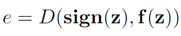
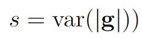
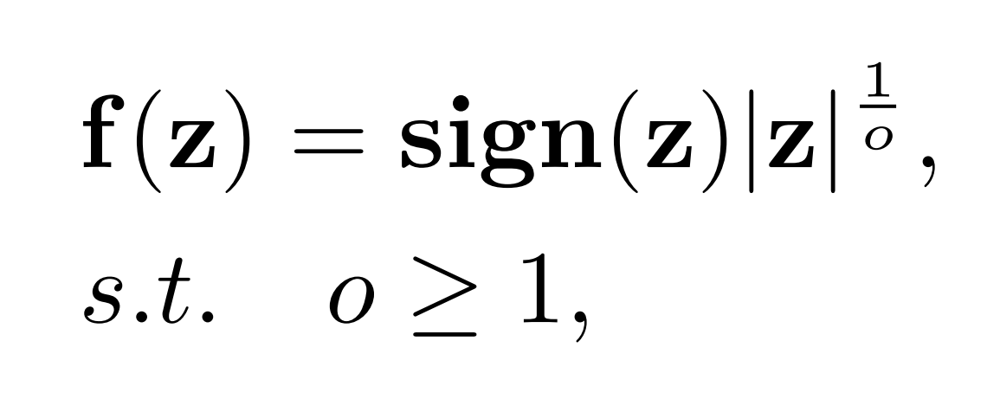
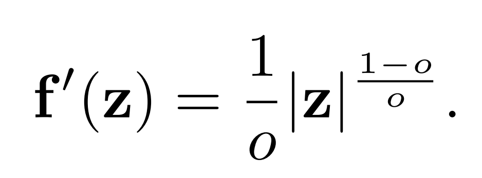
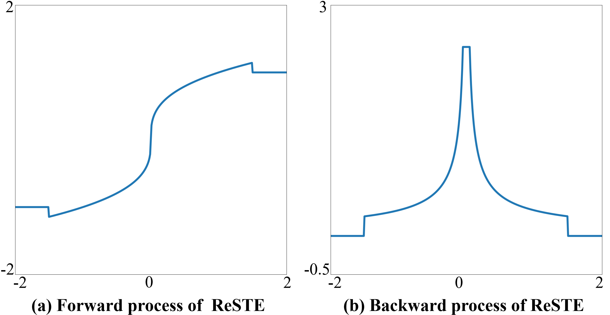

# Estimator Meets Equilibrium Perspective: A Rectified Straight Through Estimator for Binary Neural Networks Training

Official implement of ReSTE.  | [Paper](https://openaccess.thecvf.com/content/ICCV2023/html/Wu_Estimator_Meets_Equilibrium_Perspective_A_Rectified_Straight_Through_Estimator_for_ICCV_2023_paper.html) | [Personal Homepage](https://dravenalg.github.io/).

Xiao-Ming Wu, Dian Zheng, Zu-Hao Liu, Wei-Shi Zheng*.

Accepted at ICCV 2023!

If you have any questions, feel free to contact me by wuxm65@mail2.sysu.edu.cn.

## Abstract

Binary Neural Networks (BNNs) attract great research enthusiasm in recent years due to its great performance in neural networks compression. The pioneering work BinaryConnect proposes to use Straight Through Estimator (STE) to mimic the gradients of the sign function in BNNs training, but it also causes the crucial inconsistency problem due to the difference between the forward and the backward processes. Most of the previous methods design different estimators instead of STE to mitigate the inconsistency problem. However, they ignore the fact that when reducing the estimating error, the gradient stability will decrease concomitantly, which makes the gradients highly divergent, harming the model training and increasing the risk of gradient vanishing and gradient exploding. To fully take the gradient stability into consideration, we present a new perspective to the BNNs training, regarding it as the equilibrium between the estimating error and the gradient stability. In this view, we firstly design two indicators to quantitatively demonstrate the equilibrium phenomenon. In addition, in order to balance the estimating error and the gradient stability well, we revise the original straight through estimator and propose a power function based estimator, Rectified Straight Through Estimator (ReSTE for short). Comparing to other estimators, ReSTE is rational and capable of flexibly balancing the estimating error with the gradient stability. Extensive experiments on CIFAR-10 and ImageNet datasets show that ReSTE has excellent performance and surpasses the state-of-the-art methods without any auxiliary modules or losses. 

## Overall

The core idea of our method is that we present a new perspective to the BNNs training, regarding it as the equilibrium between the estimating error and the gradient stability. We also design two indicators to demonstrate the estimating error and the gradient stability.

The estimating error is the difference between the sign function and the estimator, which can be evaluated by:

The gradient stability is the divergence of the gradients of all parameters in an iteration update, which can be evaluated by:

In this view, we propose Rectified Straight Through Estimator (ReSTE for short), which is rational and capable of flexibly balancing the estimating error with the gradient stability. 

The equavalent forward process of ReSTE is :

The backward process of ReSTE is:

We visualize the forward and backward processes of ReSTE as follow.

## Dependencies

- Python 3.8
- torch == 2.0.1
- torchvision == 0.15.2
- scipy == 1.10.1

- **NOTE:** The version is not strictly required and can be flexibly adjusted based on your CUDA.

## How to Run

### CIFAR-10 Training

	python main.py \
	--gpus 0 \
	--model resnet20_1w1a (or resnet20_bireal_1w1a or resnet18_1w1a or vgg_small_1w1a) \
	--results_dir ./cifar_resnet20_1w1a \
	--data_path [DATA_PATH] \
	--dataset cifar10 \
	--epochs 1000 \
	--lr 0.1 \
	-b 256 \
	-bt 128 \
	--estimator ReSTE (or STE) \
	--o_end 3 \
	--warm_up \

### ImageNet Training

	python  main.py \
	--gpus 0 \
	--model resnet18_1w1a (or resnet34_1w1a) \
	--results_dir ./imagenet_resnet18_1w1a \
	--data_path [DATA_PATH] \
	--dataset imagenet \
	--epochs 250 \
	--lr 0.1 \
	-b 750 \
	-bt 256 \
	--estimator ReSTE (or STE) \
	--o_end 3

### Other Arguments
	--cal_ind, whether calculate the indicators of fitting error and gradient stability. (not support for resume currently)
	--a32, whether test the setting of 1W/32A.
	--model, we can test full-precision models with "resnet20", "resnet 18", "vgg_small".
	--resume, whether resume to latest checkpoint. (set the same arguments as origin)
	--evaluate, evaluate model on validation set. (set model and dataset to evaluate)
	--seed, the random seed we used (default: 1234).
	--weight_decay, weight decay of loss. (default: 1e-4).
	--momentum, momentum value of sgd (default: 0.9).
	--workers, number of data loading workers (default: 8).
	--print_freq, print frequency (default: 100).
	--time_estimate, print estimating finish time,set to 0 to disable (default:1).

## Results

### Model performance of ReSTE in CIFAR-10 dataset.

|      Backbone      | Epoch | Batch | o_end | W/A | Top-1 (%) | Paper data|
| :----------------: | :-------: | :-------: | :------: | :-------: | :------: | :------: |
| **ResNet-20**  |  1000   |  256  |  3  | 1 / 1 | 86.75 |✔ |
| **ResNet-20**  |  1000   |  256  |  3  | 1 / 32 | 91.32 |✔ |
| **ResNet-20 Bireal**  |  1000   |  256  |  3  | 1 / 1 | 87.92 |✔ |
| **ResNet-18** |  2000   |  96  |  3  | 1 / 1 | 92.63 |✔ |
| **VGG small**  |  1000   |  256  |  3  | 1 / 1 | 92.55 |✔ |

### Model performance of ReSTE in imagenet dataset.

|      Backbone      | Epoch | Batch | o_end | W/A | Top-1 (%) | Top-5 (%) | Paper data|
| :----------------: | :-------: |  :------: | :------: | :-------: | :------: |  :------: | :------: |
| **ResNet-18** |  150   |  512  | 3 | 1 / 1 | 60.01 | 82.14 |✘ |
| **ResNet-18** |  200   |  512  | 3 | 1 / 1 | 60.62 | 82.52 |✘ |
| **ResNet-18** |  200   |  750  | 3 | 1 / 1 | 60.43 | 82.48 |✘ |
| **ResNet-18** |  250   |  750  | 3 | 1 / 1 | 60.88 | 82.59 |✔ |
| **ResNet-18** |  250   |  750  | 3 | 1 / 32 | 67.40 | 87.20 |✔ |
| **ResNet-34**  |  250   |  750  | 3 | 1 / 1 | 65.05 | 85.78 |✔ |
| **ResNet-34**  |  250   |  750  | 3 | 1 / 32 | 70.74 | 89.50 |✔ |

- **NOTE 1:** To ensure the reproducibility, please refer to the training details we provided above (the parameters not provided use the default parameters in our code).
- **NOTE 2:** If we enlarge the batch size or the training epochs, the performance will be further boosted.  We also report the results with different pairs of batch size and training epochs for comparison.
- **NOTE 3:** It is better to train on single GPU to get better performance, since that when using multiple GPUs, the batch size on per GPU will decrease, which will affect the batch normalization. (Or maybe you can revise the code using a cross-GPU synchronized Batch Normalization to compensate it.)

## Citation

If you use our code or models in your research, please cite our paper with

	@inproceedings{wu2023estimator,
	  title={Estimator meets equilibrium perspective: A rectified straight through estimator for binary neural networks training},
	  author={Wu, Xiao-Ming and Zheng, Dian and Liu, Zuhao and Zheng, Wei-Shi},
	  booktitle={Proceedings of the IEEE/CVF International Conference on Computer Vision},
	  pages={17055--17064},
	  year={2023}
	}

